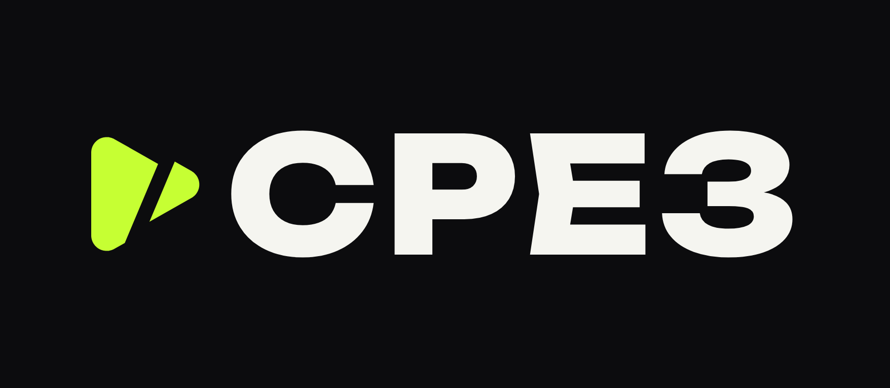
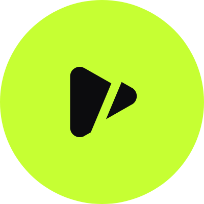
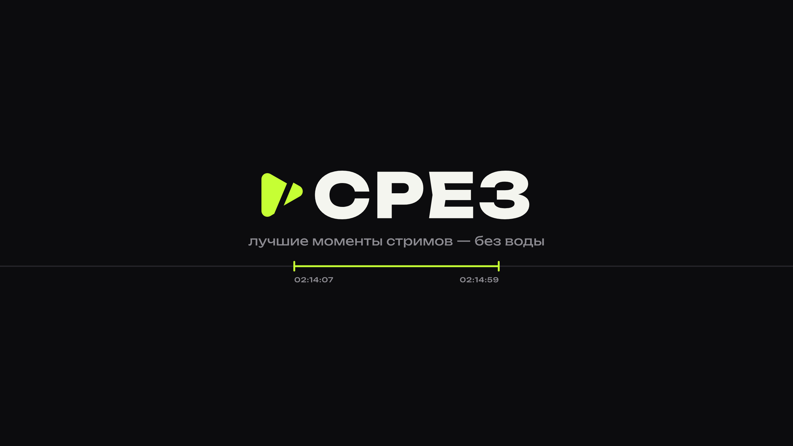
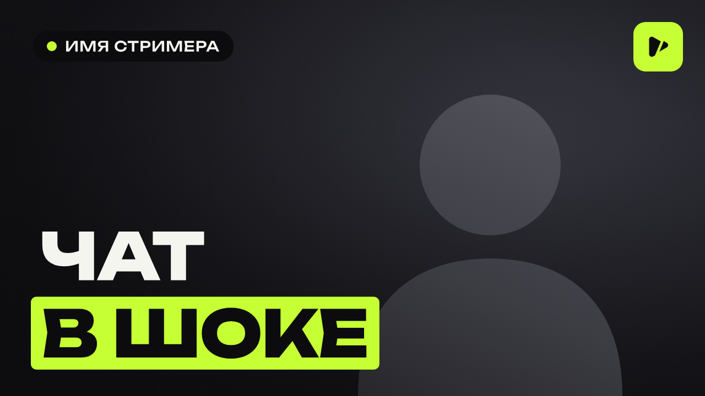

# СРЕЗ — фирменный стиль YouTube-канала

Канал с нарезками стримов популярных русскоязычных стримеров.
Стиль минималистичный: почти чёрный фон, тёплый белый и один яркий акцент (лайм).



> **Нарезчик:** автоматическая нарезка лучших моментов из стримов в один ролик с плашками стримеров.
> Подробнее в [docs/clipper.md](docs/clipper.md).

---

## 1. Название и псевдоним

| | |
|---|---|
| **Название канала** | **СРЕЗ** |
| **Латиницей** | SREZ |
| **Псевдоним (хэндл)** | `@srezclips`. Если занят, подойдут `@srez.tv`, `@srez_live`, `@srezstream` |
| **Ник автора** | **Резак**, тот, кто режет стримы. Так можно подписывать описания и ответы в комментариях |
| **Слоган** | «Лучшие моменты стримов — без воды» |
| **Второй слоган** | «6 часов стрима — 6 минут сути» |

**Почему «СРЕЗ».** У слова два смысла: вырезанный кусок эфира и «срез» как снимок происходящего на стрим-сцене.
В нём четыре буквы, его легко запомнить, набрать в поиске и прочитать на маленьком значке.

Запасные варианты, если имя занято: **ТАЙМКОД**, **СТОПКАДР**, **ОТРЕЗОК**.

---

## 2. Логотип

Знак — кнопка ▶ «play», рассечённая косым срезом «/»: видео, из которого вырезали самое главное.
Слово набрано шрифтом Unbounded. Фирменная засечка в букве «Е» тоже выглядит как надрез.

| Файл | Где использовать |
|---|---|
| `logo/srez-logo-dark.png` / `.svg` | основной, на тёмном фоне |
| `logo/srez-logo-light.png` / `.svg` | на светлом фоне |
| `logo/srez-logo-transparent-white.png` | поверх видео и тёмных картинок |
| `logo/srez-logo-transparent-black.png` | поверх светлых картинок |
| `logo/srez-mark-lime.png` / `-black` / `-white` | только знак (1024×1024, прозрачный фон): заставки, стикеры, соцсети |

SVG-файлы векторные: их можно масштабировать без потери качества, текст в них переведён в кривые.

---

## 3. Фото профиля



- **Основной:** `avatar/srez-avatar-lime-800.png`. Чёрный знак на лаймовом фоне хорошо заметен в ленте подписок и в комментариях, и в тёмной, и в светлой теме.
- **Альтернатива:** `avatar/srez-avatar-dark-800.png`, лаймовый знак на чёрном.

Размер 800×800, как рекомендует YouTube. Знак стоит по центру, поэтому круглая обрезка его не задевает.

---

## 4. Баннер (шапка канала)



Файл: `banner/srez-banner-2560x1440.png`.

Логотип, слоган и «таймлайн» с выделенным фрагментом помещаются в безопасную зону 1546×423, поэтому всё читается и на телефоне.
На компьютере линия таймлайна растягивается на всю ширину. Разметку зон показывает `banner/preview-safe-zones.png`.

---

## 5. Описание канала

Вставляется в YouTube Studio → Настройка канала → Основные сведения → Описание (до 1000 символов):

```
СРЕЗ — лучшие моменты стримов без воды.

Смотрим многочасовые эфиры популярных стримеров и вырезаем главное: угарные ситуации, реакции, споры, донаты и легендарные фразы. 6 часов стрима — 6 минут сути.

Что здесь:
▸ свежие нарезки после каждого громкого эфира
▸ подборки лучших моментов недели
▸ таймкоды и ссылка на оригинальный стрим в каждом видео

Все права на трансляции принадлежат их авторам. Ссылка на стримера есть в описании каждого ролика: поддержите его подпиской.

Знаешь момент, который нельзя пропустить? Кидай таймкод в комментарии, лучшие попадут в видео.

Подпишись и включи 🔔, чтобы не пропустить новый срез.

— Резак
```

**Ключевые слова канала** (Настройки → Канал → Ключевые слова):

```
нарезки стримов, лучшие моменты стримов, нарезка, стримеры, твич, twitch, kick, vk play live, хайлайты, клипы стримеров, смешные моменты, реакции стримеров, срез
```

---

## 6. Значок на видео (водяной знак)

`watermark/srez-watermark-150.png` (150×150, прозрачный фон).
Загружается в Настройка канала → Брендинг → Значок видео. Он показывается в углу ролика, и по клику на него зритель подписывается на канал.

---

## 7. Превью для видео



- `thumbnail/srez-thumbnail-overlay-1280x720.png` — прозрачная накладка: затемнение снизу и значок канала. Положите её поверх кадра со стрима и добавьте текст.
- `thumbnail/srez-thumbnail-example-1280x720.png` — пример готового превью. Вместо серого силуэта ставится кадр со стримером.

**Правила превью, по которым канал узнают в ленте:**
1. Лицо стримера с яркой эмоцией, справа.
2. Слева снизу 2–3 слова шрифтом Unbounded Black. Одно слово белое, второе на лаймовой плашке.
3. Слева сверху тёмная плашка с лаймовой точкой и ником стримера.
4. Значок канала стоит справа сверху. Правый нижний угол оставьте пустым: там YouTube показывает длительность ролика.

---

## 8. Шаблоны для роликов

**Название** (ник стримера в начале, чтобы ролик находили в поиске, до ~60 символов):

```
[Ник стримера] [что произошло]
```
Пример: `Ник не ожидал такого доната`

**Описание видео:**

```
[Одно предложение: что случилось на стриме]

Стример: [ник] — [ссылка на его канал]
Оригинальный стрим: [ссылка] ([дата])

Таймкоды:
00:00 — [момент]
01:24 — [момент]

СРЕЗ — лучшие моменты стримов без воды.
Подписаться: [ссылка на канал]

#нарезка #[ник] #стрим
```

---

## 9. Цвета и шрифт

| Цвет | HEX | Где |
|---|---|---|
| Чернила | `#0C0C0E` | фон |
| Лайм | `#C6FF33` | акцент: знак, плашки, выделения |
| Белый | `#F5F5F0` | основной текст |
| Серый | `#8C8C92` | второстепенный текст |
| Линии | `#26262B` | разделители, подложки |

**Шрифт:** [Unbounded](https://fonts.google.com/specimen/Unbounded), бесплатный (лицензия OFL) и с кириллицей.
Он есть в Canva и Google Fonts, файл также лежит в `fonts/`. Для заголовков берите Black или ExtraBold, для подписей Regular.

---

## 10. Как всё загрузить: чек-лист

1. YouTube Studio → **Настройка канала → Брендинг**:
   - Фото профиля: `avatar/srez-avatar-lime-800.png`
   - Баннер: `banner/srez-banner-2560x1440.png`
   - Значок видео: `watermark/srez-watermark-150.png`, показ «на протяжении всего видео»
2. **Основные сведения:**
   - Название: `СРЕЗ`
   - Псевдоним: `@srezclips`
   - Описание: текст из раздела 5
   - Ссылки: Telegram или TikTok канала, если они есть. Они появятся на баннере
3. **Настройки → Канал:** ключевые слова из раздела 5, страна — Россия.
4. Для каждого ролика: превью по правилам из раздела 7, описание по шаблону из раздела 8.

---

## ⚠️ Про авторские права

Нарезки чужих стримов часто получают жалобы и страйки. Чтобы канал прожил долго:

- **Спросите разрешения** у стримера или его модераторов. Многие стримеры сами разрешают нарезки при условии, что вы указываете автора.
- **Всегда указывайте автора** и ставьте ссылку на оригинальный стрим. Шаблон описания это уже учитывает.
- **Вырезайте или заглушайте музыку**, которая играет на стриме. Чаще всего Content ID срабатывает именно на неё.
- **Добавляйте свою работу:** монтаж, субтитры, зумы, подписи. Ролик со своей обработкой реже попадает под претензии, чем просто перезалитый кусок эфира.

---

## Как пересобрать картинки

Все изображения генерируются кодом из `src/`, так что цвет, слоган или размеры легко поменять в `src/build.py`:

```bash
pip install uharfbuzz fonttools
python3 src/build.py   # собирает SVG
node src/render.cjs    # рендерит PNG (нужен playwright)
```
