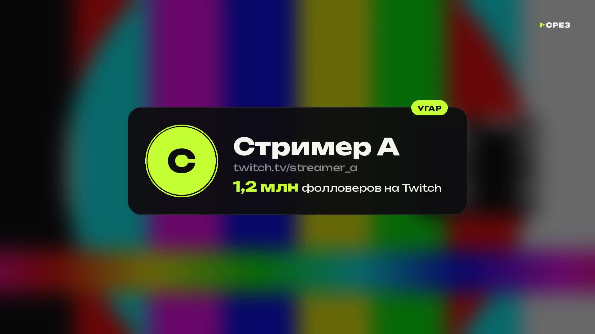

# Нарезчик СРЕЗ

Берёт несколько длинных стримов, находит в них самые сильные моменты и монтирует
из них один ролик на 30 или 60 минут. Перед каждым клипом идёт плашка: аватар,
имя стримера, ссылка на его Twitch и число фолловеров.



## Как он находит моменты

Нарезчик не смотрит весь стрим подряд, иначе на 6 часов эфира уходили бы часы. Он слушает два сигнала:

1. **Чат.** Когда на стриме что-то происходит, чат взрывается, и это самый надёжный признак.
   Считается, сколько сообщений приходит в секунду, и какие в них реакции:
   - `KEKW`, `ахахах`, `ору` — **угар**
   - `monkaS`, `страшно`, `😱` — **жуть**
   - `Pog`, `ого`, `имба` — **эпик**
   - `WTF`, `ЧТО???` — **шок**

   Чат реагирует на 5–10 секунд позже события, это учитывается.
2. **Звук.** Крики, смех, резкие скачки громкости. Громкость сравнивается с обычным уровнем этого же стримера, поэтому тихий и громкий стример оцениваются одинаково честно.

Из этого получается «сила» каждого момента. Дальше нарезчик:
- берёт пики и захватывает 15–20 секунд до них, чтобы было понятно, с чего всё началось;
- режет клипы по паузам в речи, а не на полуслове;
- набирает самые сильные моменты, пока не наберётся нужная длина ролика, и следит, чтобы один стример не занял весь выпуск;
- ставит самый сильный момент в начало, второй по силе в конец, остальные идут вперемешку между стримерами.

**Быстро.** Для ссылок на Twitch сначала скачиваются только звук и чат, это в 20–50 раз меньше видео.
Видео потом скачивается только кусками вокруг выбранных моментов. Анализ 6-часового файла с диска занимает около минуты.

## Реклама на экране стрима

Баннеры спонсоров, логотипы казино, QR-коды и промокоды закрываются при монтаже: по умолчанию размываются до нечитаемости (`mask_style = "fill"` закрашивает их фоном).

Как это работает:
1. Команда `prepare` скачивает куски видео и ищет статичные элементы с чёткими контурами: реклама висит на одном месте, пока игра и вебка меняются.
2. По каждому стримеру получается лист проверки `work/<проект>/layouts/<стрим>.jpg` с сеткой 10%. Лаймовым обведены кандидаты (S1, S2…), красным — уже заданные маски (M1, M2…).
3. Я смотрю листы, отделяю рекламу от интерфейса игры и рамки вебки и записываю маски в `work/<проект>/masks.json`:

```json
{"vod2895198615": [[0.70, 0.01, 0.28, 0.17], {"box": [0.0, 0.66, 0.16, 0.27], "from": "1:20:00", "to": "2:05:00"}]}
```

Координаты задаются долями кадра: `x, y, ширина, высота`. `from`/`to` нужны, если баннер висит только часть стрима.
Маски можно задать и прямо в проекте: `masks = [[0.70, 0.01, 0.28, 0.17]]` внутри `[[stream]]`.

## Мат

Для подростковой аудитории мат запикивается: `censor = "beep"` в разделе `[video]` проекта
(`"mute"` — просто заглушить, `"off"` — оставить как есть).

Речь каждого выбранного клипа распознаётся с точным временем слов (faster-whisper, модель `small`),
корни мата ищутся по словарю в `srez/censor.py`, на их месте звук глушится и звучит короткий писк 1 кГц.
Распознавание идёт около минуты на клип и кэшируется в `work/<проект>/censor/`, повторный монтаж его не повторяет.
Неразборчиво сказанное слово распознаватель может пропустить, поэтому ролик стоит посмотреть перед публикацией.

## Что получается на выходе

В папке `output/`:
- `<проект>.mp4` — готовый ролик 1920×1080. Громкость клипов выровнена, реклама на экране закрыта, перед каждым клипом короткая плашка (1,4 с) со звуком «вжух», в конце 12 секунд концовки под конечные элементы YouTube.
- `<проект>_описание.txt` — описание для YouTube: таймкоды (главы) по каждому клипу, ссылки на всех стримеров и оригинальные трансляции, хэштеги.

В папке `work/<проект>/`:
- `candidates.json` — все найденные моменты. Лишний момент можно выключить (`"keep": false`) или подписать (`"title": "..."`).
- `review.md` — обзор для проверки: по каждому моменту 4 кадра и что писал чат.

## Как пользоваться

### Вариант 1: присылаете стримы мне (Claude)

Пришлите ссылки на записи стримов (Twitch VOD) или сами файлы и скажите длину ролика.
Я запущу анализ, просмотрю найденные моменты (кадры и чат), уберу слабые, подпишу клипы и смонтирую ролик.

Для работы по ссылкам облачной среде нужен доступ в интернет к Twitch, сейчас он закрыт.
Откройте настройки среды (меню среды в заголовке сессии → Edit) → **Network access** и выберите полный доступ (Full).
Можно вместо этого добавить в Allowed domains домены `twitch.tv`, `gql.twitch.tv`, `usher.ttvnw.net`, `static-cdn.jtvnw.net`, `cloudfront.net`.
Подробнее: https://code.claude.com/docs/en/cloud-environments#network-access

### Вариант 2: запускаете у себя на компьютере

1. Установите [Python 3.11+](https://www.python.org/downloads/) и [ffmpeg](https://ffmpeg.org/download.html).
2. В папке проекта выполните: `pip install -r requirements.txt`
3. Скопируйте `examples/project.toml`, впишите свои стримы.
4. Запустите:

```bash
python -m srez check                    # проверить, что всё установлено
python -m srez auto мой_выпуск.toml     # найти моменты и смонтировать
```

Можно и по шагам: `analyze` ищет моменты → вы правите `candidates.json` → `prepare` скачивает видео и находит рекламу → вы проверяете маски → `render` монтирует.
Повторный `render` пересобирает только то, что изменилось.

## Скорость

Замер на облачном сервере с 4 ядрами:

| Этап | Время |
|---|---|
| Анализ звука и чата | ~10 секунд на час стрима (файл с диска) |
| Монтаж в 1080p | ~0,3 минуты на минуту ролика: 30 минут ролика ≈ 9–10 минут |

На домашнем компьютере с 8+ ядрами монтаж идёт быстрее. Чтобы ускорить ещё сильнее, укажите `preset = "ultrafast"`, качество при этом станет немного ниже.

## Про число фолловеров

На Twitch есть **фолловеры** (бесплатная подписка, число публичное) и **сабы** (платная подписка, число скрыто).
Поэтому на плашке показываются фолловеры, данные берутся с Twitch в момент сборки.
Если Twitch недоступен, число можно вписать вручную: `followers = 1250000`.

## Ограничения

- Без чата нарезчик ищет только по звуку, и качество заметно ниже. Если чат скачать не удалось, его можно скачать программой [TwitchDownloader](https://github.com/lay295/TwitchDownloader) (Chat Download → JSON) и указать в проекте `chat = "..."`.
- Нарезчик понимает реакции, но не смысл шуток. Поэтому лучший результат даёт проверка `review.md` перед монтажом.
- Помните про авторские права: см. раздел в [README](../README.md).
